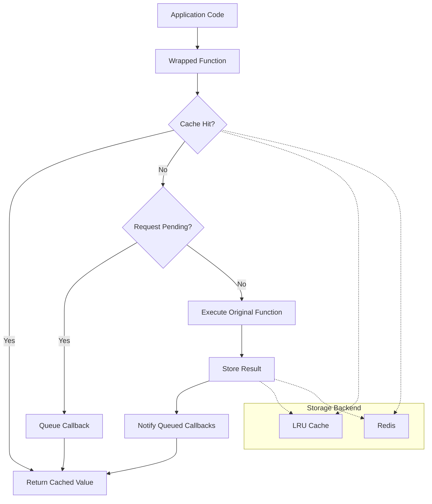
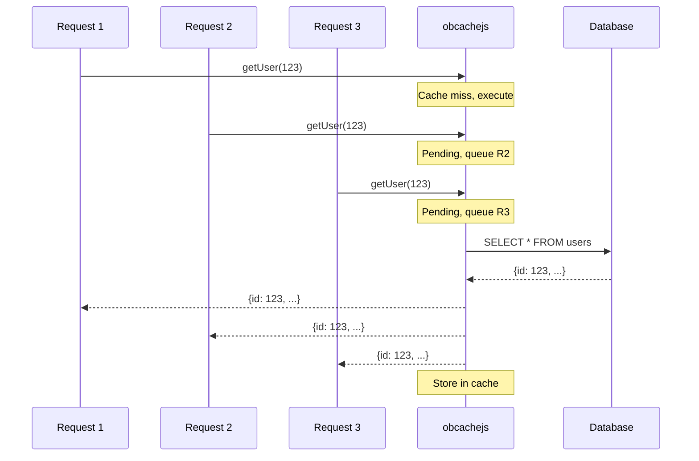
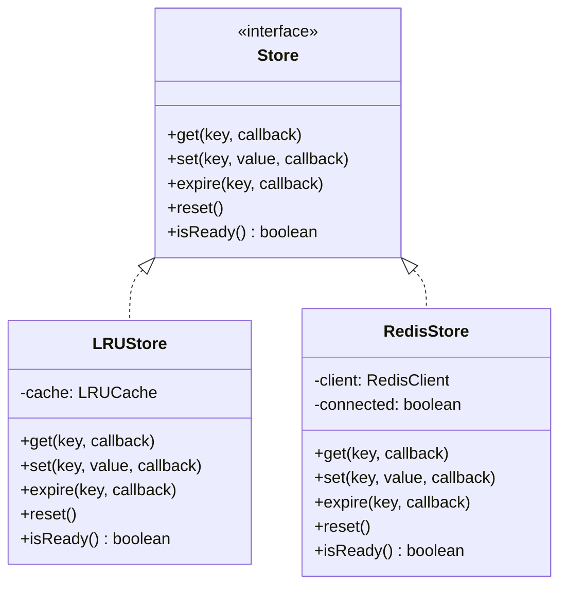

# obcachejs: Function-Level Caching for Node.js Applications

## Introduction

Caching is straightforward until it isn't. The pattern starts simple: check cache, return if hit, compute if miss, store result. But production systems quickly encounter complications: concurrent requests for the same uncached key trigger redundant computations, cache keys must be generated consistently, and switching between in-memory and distributed caches requires significant refactoring.

obcachejs addresses these problems by wrapping async functions with transparent caching. Rather than manually managing cache reads and writes, you wrap your function once and call it normally. The library handles key generation, storage, and request deduplication automatically.

## The Problem

Consider a typical caching implementation:

```javascript
async function getUser(id) {
  const cacheKey = `user:${id}`;
  const cached = await cache.get(cacheKey);
  if (cached) return cached;

  const user = await db.query('SELECT * FROM users WHERE id = ?', [id]);
  await cache.set(cacheKey, user, { ttl: 60000 });
  return user;
}
```

This works but has issues:

1. **Key generation**: Manual key construction is error-prone and inconsistent across functions
2. **Thundering herd**: 100 concurrent requests for the same uncached user trigger 100 database queries
3. **Backend coupling**: Switching from Redis to LRU requires rewriting every cached function
4. **Boilerplate**: Every function repeats the same cache-check pattern

## Architecture

obcachejs separates concerns into three layers: the wrapper that intercepts function calls, the key generator that creates consistent cache keys, and the storage backend that persists values.



### Key Generation

Cache keys are generated by hashing the function name and serialized arguments using sigmund. This produces consistent keys without manual construction:

```javascript
// Function: getUser, Args: [123]
// Key: "a1b2c3d4" (hash of {f: "getUser0", a: [123]})

// Function: getUser, Args: [456]
// Key: "e5f6g7h8" (different hash)
```

The `skipArgs` option excludes volatile arguments (timestamps, request IDs) from key generation:

```javascript
// Skip argument at index 1 (timestamp)
const fn = cache.wrap(function(id, timestamp, cb) {
  // ...
}, null, [1]);

// Both calls hit same cache key
fn(123, Date.now(), callback);  // Key based on [123]
fn(123, Date.now(), callback);  // Same key
```

### Request Deduplication

When multiple requests arrive for the same uncached key, only the first executes the underlying function. Subsequent requests queue their callbacks and receive the same result:



This prevents the thundering herd problem where a cache miss under load triggers redundant backend calls.

## Usage

### Basic Setup

```javascript
const obcache = require('obcachejs');

const cache = new obcache.Create({
  max: 1000,           // Maximum cached keys
  maxAge: 60000,       // TTL in milliseconds
  queueEnabled: true   // Enable request deduplication
});

const getUser = cache.wrap(function(id, callback) {
  db.query('SELECT * FROM users WHERE id = ?', [id], callback);
});

// Callback style
getUser(123, (err, user) => console.log(user));

// Promise style
const user = await getUser(123);
```

### Redis Backend

For distributed caching across multiple processes or servers:

```javascript
const cache = new obcache.Create({
  max: 10000,
  maxAge: 300000,
  id: 1,  // Required for Redis key namespacing
  redis: {
    host: 'localhost',
    port: 6379,
    connectTimeout: 5000
  }
});

// Check connection before serving requests
if (!cache.isReady()) {
  throw new Error('Redis not connected');
}
```

### Cache Management

```javascript
// Pre-populate cache (warmup)
cache.warmup(getUser, 123, { id: 123, name: 'Alice' });

// Invalidate after mutation
await db.query('UPDATE users SET name = ? WHERE id = ?', ['Bob', 123]);
cache.invalidate(getUser, 123);

// Monitor performance
console.log(cache.stats);
// { hit: 450, miss: 50, reset: 0, pending: 0 }
```

## Design Decisions

### Callback-First Internal Design

The core uses callbacks internally, with Promise support added via wrapper. This maintains compatibility with callback-based libraries and avoids Promise overhead in hot paths. The wrapped function detects the calling convention:

```javascript
// Callback detected - direct execution
fn(arg, callback);

// No callback - wrap in Promise
const result = await fn(arg);
```

### Automatic Key Generation vs Manual Keys

obcachejs generates keys automatically rather than requiring manual specification. This trades some control for consistency and reduced boilerplate. For cases requiring custom keys, wrap a function that takes the key as an argument:

```javascript
const getByKey = cache.wrap(function(key, callback) {
  // key is now part of the cache key
  fetchData(key, callback);
});
```

### Storage Backend Abstraction

Both LRU and Redis backends implement the same interface: `get`, `set`, `expire`, `reset`, `isReady`. This allows swapping backends without changing application code:



## When to Use obcachejs

**Good fit:**
- Caching database queries or API responses
- Functions with deterministic outputs for given inputs
- Systems experiencing repeated calls with same arguments
- Applications needing both in-memory and distributed caching
- Services under load where request deduplication prevents overload

**Not ideal for:**
- Functions with side effects
- Very short-lived data (sub-second TTL)
- Large binary data (serialize/deserialize overhead)
- Cases requiring fine-grained cache key control

## Performance Considerations

- **Key generation**: sigmund hashing adds microseconds per call; negligible compared to typical cache operations
- **Memory**: LRU cache stores serialized values; monitor with `cache.stats` and adjust `max` accordingly
- **Redis latency**: Network round-trip adds 1-5ms; batch operations where possible
- **Request deduplication**: Most effective under concurrent load; minimal overhead when disabled

## Conclusion

obcachejs provides a focused solution for function-level caching in Node.js. It handles the mechanical aspects of caching—key generation, storage abstraction, and request deduplication—so application code can focus on business logic.

The library is appropriate when you need transparent caching for async functions with consistent behavior across different storage backends. It is not a general-purpose cache library and intentionally avoids features like cache-aside patterns, distributed invalidation, or cache hierarchies.

For applications that fit this model, obcachejs reduces caching boilerplate while preventing common pitfalls like thundering herd and inconsistent key generation.

---

*Repository: [github.com/vnykmshr/obcachejs](https://github.com/vnykmshr/obcachejs)*
